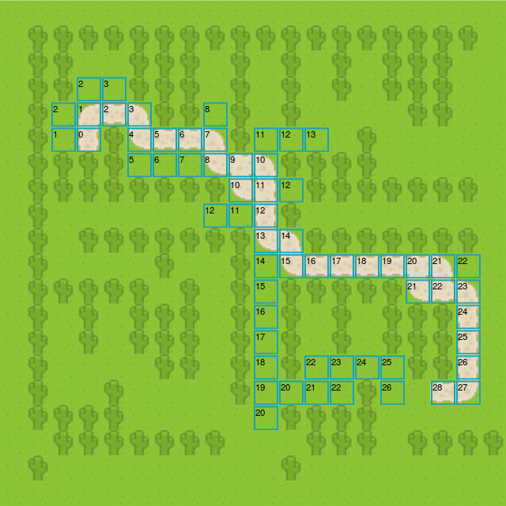

### Struct Map

	. . . . . . . . . . . . . . . . . . . .
	. # # # # # # # # # # # # # # # # # # .
	. # # . . # # # . # . # . # . # # # . .
	. # # . . # # # . # . # . # . # # # . .
	. # . . . . # # . # . # . . . . # # . .
	. # . S # . . . . # . . . . # . . . . .
	. # # # # . . . . . . # # # # . . . . .
	. # # # # # # # # . . . # # # # # # # .
	. # . . . . . . . . . # . . . . . . . .
	. # . # # # # # # # . . # # # # # # # .
	. # . . . . # . . # . . . . . . . . . .
	. # # # # # . # . # . # # # # # . . . .
	. # . # . # # # . # . # . # . # # # . .
	. # . # . # # # . # . # . # . # # # . .
	. # . . . . # # . # . # . . . . # # . .
	. # . . # . . . . # . . . . # . . G . .
	. # # # # . . . . . . # # # # . . . . .
	. . # # # # # # # . . . # # # . # # # #
	. # . . . . . . . . . # . . . . . . . .
	. . . . . . . . . . . . . . . . . . . .

Where: '.' is 1 (walkable) and '#' is 9 (no-walkable)

Width and Height of map is: 20 (Start from 0)

- Start Coordinate (3, 5) --> S
- Goal Coodinate (17, 15) --> G

### Struct Map

